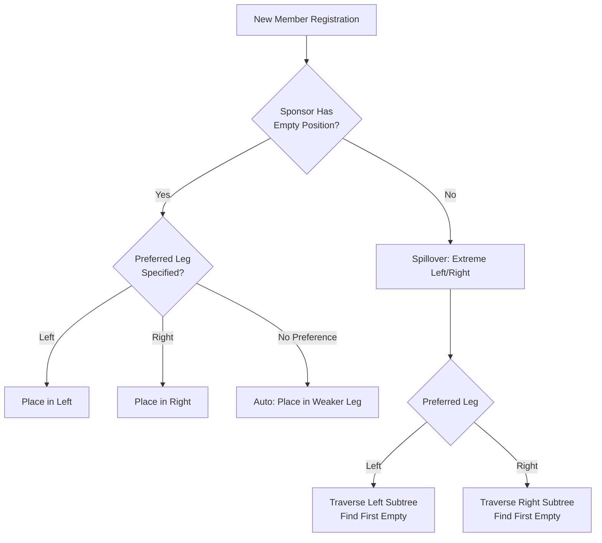
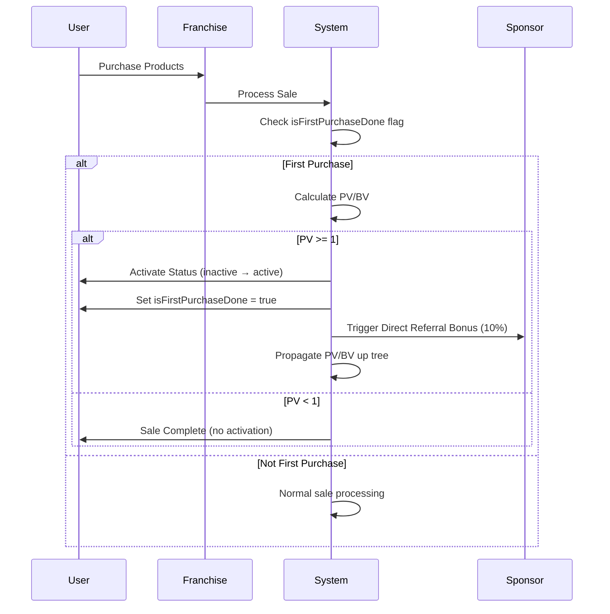
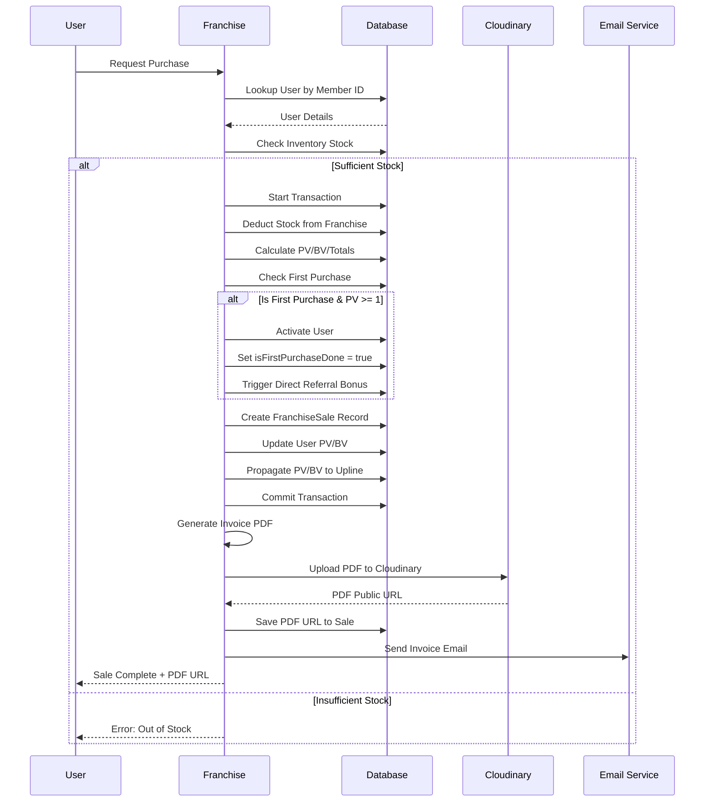

# SSVPL MLM System - Technical Logic Documentation

> **Comprehensive Business Rules, Calculations, and Workflow Documentation**  
> Last Updated: February 2026 | Version 2.0

---

## 📑 Table of Contents

- [Binary Tree Structure](#-binary-tree-structure)
- [User Activation Logic](#-user-activation-logic)
- [PV/BV Propagation](#-pvbv-propagation)
- [Commission & Bonus Systems](#-commission--bonus-systems)
- [Rank Progression](#-rank-progression)
- [Payout Processing](#-payout-processing)
- [Franchise Sales Workflow](#-franchise-sales-workflow)
- [Invoice Generation](#-invoice-generation)
- [Mathematical Formulas](#-mathematical-formulas)

---

## 🌳 Binary Tree Structure

### Overview
SSVPL uses a **Binary MLM Tree** where each member can have maximum 2 direct children (left and right legs).

### Placement Logic



### Implementation

**Function**: `findAvailablePosition(sponsorId, preferredPosition)`

**Algorithm**:
```javascript
1. Fetch Sponsor
2. IF preferredPosition === 'left':
     IF sponsor.leftChild is NULL:
         RETURN { parentId: sponsor, position: 'left' }
     ELSE:
         TRAVERSE extreme left of leftChild subtree
         RETURN first empty position
         
3. IF preferredPosition === 'right':
     Similar logic for right leg
     
4. ELSE (no preference):
     Default to extreme left of sponsor's tree
```

**Database Fields**:
```javascript
User {
  sponsorId: String,       // Who invited (for commissions)
  parentId: String,        // Binary tree parent (for placement)
  position: 'left' | 'right' | 'root',
  leftChild: ObjectId,
  rightChild: ObjectId
}
```

---

## ✅ User Activation Logic

### Rule
A user **activates** when they make their **first purchase** with `PV ≥ 1`.

### Workflow



### Database Update

**Before First Purchase**:
```javascript
User {
  status: 'inactive',
  isFirstPurchaseDone: false,
  personalPV: 0,
  totalPV: 0
}
```

**After First Purchase (PV ≥ 1)**:
```javascript
User {
  status: 'active',        // ✅ Changed
  isFirstPurchaseDone: true, // ✅ Set
  personalPV: <purchased_pv>,
  totalPV: <purchased_pv>
}
```

### Code Reference
[`sale.controller.js:L46`](file:///home/zephyrus/UlMind_Projects/sarvasolution_backend/src/controllers/franchise/sale.controller.js#L46)

---

## 📊 PV/BV Propagation

### Concept
When a user makes a purchase, their **PV (Point Value)** and **BV (Business Volume)** are added to:
1. Their own personal metrics
2. ALL upline members' leg totals

### Propagation Algorithm

**Function**: `propagateBVUpTree(userId, position, bvAmount, pvAmount)`

**Logic**:
```
START from user's parent
WHILE parent exists:
    IF parent.status === 'active':
        IF user.position === 'left':
            parent.leftLegPV += pvAmount
            parent.leftLegBV += bvAmount
            parent.fastTrack.pendingLeft += pvAmount
        ELSE (right):
            parent.rightLegPV += pvAmount
            parent.rightLegBV += bvAmount
            parent.fastTrack.pendingRight += pvAmount
        
        parent.totalPV += pvAmount
        parent.totalBV += bvAmount
        
        Save parent
        Trigger Fast-Track Matching for parent
    
    Move to parent's parent
END WHILE
```

### Example

```
        A (Active)
       / \
      B   C
     /
    D (Makes Purchase: 50 PV, 40 BV)
```

**Result**:
- **D**: personalPV = 50, personalBV = 40
- **B**: leftLegPV += 50, leftLegBV += 40, totalPV += 50
- **A**: leftLegPV += 50, leftLegBV += 40, totalPV += 50

**Inactive Parent Handling**: If B is inactive, B receives NO updates. A still receives updates (D is in A's left leg).

### Code Reference
[`mlm.service.js:L97-L157`](file:///home/zephyrus/UlMind_Projects/sarvasolution_backend/src/services/business/mlm.service.js#L97-L157)

---

## 💰 Commission & Bonus Systems

### 1. Direct Referral Bonus

**Trigger**: Downline completes first purchase (activation)  
**Amount**: **10%** of downline's first purchase amount  
**Eligibility**: Automatic for sponsor

**Formula**:
```
Direct Bonus = First Purchase Amount × 0.10
Net Amount = Direct Bonus - Admin Charge (5%)
```

**Example**:
- Downline first purchase: ₹5,000
- Gross Bonus: ₹500
- Admin Charge: ₹25 (5%)
- **Net to Sponsor**: ₹475

---

### 2. Fast Track Bonus (PV-Based)

**Concept**: Pair matching between left and right leg PV  
**Max Closings**: **6 per day**  
**Minimum Gap**: **4 hours** between closings  
**Payout**: **₹500 per pairing**

#### Matching Rules

**First Closing**: Must meet 2:1 or 1:2 ratio
- 2:1 → 1000 Left PV : 500 Right PV
- 1:2 → 500 Left PV : 1000 Right PV

**Subsequent Closings**: 1:1 ratio
- 500 Left PV : 500 Right PV

#### Deduction Rule
Every 3rd, 6th, 9th, 12th closing → **Full amount deducted** for rank upgrade contribution

**Deduction Schedule**:
- 3rd closing: ₹500 → Deducted
- 6th closing: ₹500 → Deducted
- 9th closing: ₹500 → Deducted
- 12th closing: ₹500 → Deducted + **Auto Bronze Upgrade**

#### Formula

```
Available Left = pendingLeft + carryForwardLeft
Available Right = pendingRight + carryForwardRight

IF (closing_count % 3 === 0 AND closing_count <= 12):
    Net Amount = 0 (deducted for rank)
ELSE:
    Gross = ₹500
    Admin Charge = Gross × 0.05 = ₹25
    TDS = Gross × 0.02 = ₹10
    Net Amount = ₹500 - ₹25 - ₹10 = ₹465
```

#### Carryforward Logic

```
After Matching:
    carryForwardLeft = Available Left - Matched Left
    carryForwardRight = Available Right - Matched Right
    pendingLeft = 0
    pendingRight = 0
```

**Code Reference**: [`matching.service.js:L12-L163`](file:///home/zephyrus/UlMind_Projects/sarvasolution_backend/src/services/business/matching.service.js#L12-L163)

---

### 3. Star Matching Bonus

**Concept**: Pair matching based on downline rank achievements (stars)  
**Max Closings**: **6 per day**  
**Minimum Gap**: **4 hours**  
**Payout**: **₹1,500 per pairing**

#### Matching Ratios

**Priority 1**: 20:10 (or 10:20)
- 20 Stars Left : 10 Stars Right
- OR 10 Stars Left : 20 Stars Right

**Priority 2**: 10:10
- 10 Stars Left : 10 Stars Right

#### Star Assignment

Each rank achievement in downline = **Stars added** to upline's pending count.

**Rank → Stars Mapping**:
```javascript
Bronze → 1 star
Silver → 5 stars
Gold → 30 stars
Platinum → 100 stars
Diamond → 300 stars
... (and so on)
```

#### Formula

```
Gross = ₹1,500
Admin Charge = ₹1,500 × 0.05 = ₹75
TDS = ₹1,500 × 0.02 = ₹30
Net Amount = ₹1,500 - ₹75 - ₹30 = ₹1,395
```

**Code Reference**: [`matching.service.js:L169-L253`](file:///home/zephyrus/UlMind_Projects/sarvasolution_backend/src/services/business/matching.service.js#L169-L253)

---

### 4. Rank Achievement Bonus

**Trigger**: One-time when user achieves new rank  
**Eligibility**: Based on total star matching count

**Bonus Table**:

| Rank | Stars Required | One-Time Bonus |
|------|----------------|----------------|
| Bronze | 1 | ₹500 |
| Silver | 5 | ₹2,500 |
| Gold | 30 | ₹10,000 |
| Platinum | 100 | ₹25,000 |
| Diamond | 300 | ₹75,000 |
| Blue Diamond | 750 | ₹2,00,000 |
| Black Diamond | 1,500 | ₹5,00,000 |
| Royal Diamond | 3,000 | ₹10,00,000 |
| Crown Diamond | 7,500 | ₹25,00,000 |
| Ambassador | 15,000 | ₹50,00,000 |
| Crown Ambassador | 30,000 | ₹1,00,00,000 |
| SSVPL Legend | 75,000 | ₹2,50,00,000 |

**Formula**:
```
Gross = Rank Bonus Amount
Admin Charge = Gross × 0.05
TDS = Gross × 0.02
Net Amount = Gross - Admin Charge - TDS
```

**Code Reference**: [`mlm.service.js:L177-L241`](file:///home/zephyrus/UlMind_Projects/sarvasolution_backend/src/services/business/mlm.service.js#L177-L241)

---

## 🏆 Rank Progression

### Rank Upgrade Logic

**Trigger**: Automatically checked when user's star matching count increases

**Algorithm**:
```
FOR each rank in ascending order:
    IF user.starMatching >= rank.requiredStars:
        IF rank > user.currentRank:
            Upgrade user to new rank
            Credit rank bonus to wallet
            Add to rank history
            Notify user
```

### Bronze Auto-Upgrade

**Special Rule**: On 12th fast-track closing (4th deduction), user is **force-upgraded** to Bronze rank regardless of stars.

**Code**:
```javascript
if (closingCount === 12) {
    await rankService.forceUpgrade(userId, 'Bronze');
}
```

---

## 💳 Payout Processing

### Withdrawal Request

**Minimum Amount**: ₹450  
**Schedule**: Every **Friday at 11:00 AM IST**  
**Status Flow**: `pending` → `processing` → `completed`

### Deductions

**Admin Charge**: 5%  
**TDS**: 2%

**Formula**:
```
Gross Amount = User Requested Amount
Admin Charge = Gross Amount × 0.05
TDS Amount = Gross Amount × 0.02
Net Amount = Gross Amount - Admin Charge - TDS Amount
```

**Example**:
```
User Requests: ₹1,000
Admin Charge: ₹50
TDS: ₹20
Net Credited: ₹930
```

### Weekly Earnings Transfer

**Cron Job**: Runs every **Friday 11 AM IST**

**Logic**:
```
FOR each user:
    totalWeeklyEarnings = fastTrack.weeklyEarnings + starMatching.weeklyEarnings
    
    IF totalWeeklyEarnings > 0:
        wallet.availableBalance += totalWeeklyEarnings
        fastTrack.weeklyEarnings = 0
        starMatching.weeklyEarnings = 0
```

This moves earnings from "pending" buffers to withdrawable balance.

---

## 🏢 Franchise Sales Workflow

### Complete Flow



### Transaction Safety

**All operations wrapped in MongoDB transaction**:
- Stock deduction
- Sale creation
- User PV/BV updates
- Upline propagation

If ANY step fails → **entire transaction rolls back**.

PDF generation & email happen **after** transaction commits (non-blocking).

---

## 📄 Invoice Generation

### GST Compliance

**Invoice Type**: GST Invoice with 14-column grid layout

**Tax Logic**:
```
IF Franchise State !== User State:
    Tax Type = IGST (18%)
ELSE:
    Tax Type = CGST (9%) + SGST (9%)
```

### Field Calculation

**Per Item**:
```javascript
Taxable Value = Rate × Quantity
GST Amount = Taxable Value × 0.18

IF (Inter-state):
    IGST = GST Amount
    CGST = 0
    SGST = 0
ELSE:
    IGST = 0
    CGST = GST Amount / 2
    SGST = GST Amount / 2
```

**Totals**:
```
Sub Total = Sum of all Taxable Values
Total Tax = Sub Total × 0.18
Grand Total = Sub Total + Total Tax
```

### Cloudinary Storage

**Upload Configuration**:
```javascript
{
    resource_type: 'raw',      // For non-image files
    access_mode: 'public',     // Public URL access
    folder: 'sarvasolution/invoices',
    public_id: `invoice_${saleNo}`
}
```

**Result**: Publicly accessible URL stored in `FranchiseSale.pdfUrl`

**Code Reference**: [`pdf.service.js`](file:///home/zephyrus/UlMind_Projects/sarvasolution_backend/src/services/integration/pdf.service.js), [`cloudinary.service.js:L47-L86`](file:///home/zephyrus/UlMind_Projects/sarvasolution_backend/src/services/integration/cloudinary.service.js#L47-L86)

---

## 🧮 Mathematical Formulas

### 1. Team Count Calculation

**Recursive Formula**:
```
TeamCount(node, leg) = {
    IF node is NULL: RETURN 0
    
    IF leg === 'left':
        child = node.leftChild
    ELSE:
        child = node.rightChild
    
    IF child is NULL: RETURN 0
    
    count = 1  // The direct child
    count += TeamCount(child, 'left')   // All left descendants
    count += TeamCount(child, 'right')  // All right descendants
    
    RETURN count
}
```

### 2. Fast Track Pairing

**First Closing**:
```
Pairs = {
    IF (leftPV >= 1000 AND rightPV >= 500): 1 pair
    ELSE IF (leftPV >= 500 AND rightPV >= 1000): 1 pair
    ELSE: 0 pairs
}
```

**Subsequent Closings**:
```
Pairs = MIN(
    FLOOR(leftPV / 500),
    FLOOR(rightPV / 500)
)

BUT: Max 1 pair per closing
```

### 3. Payout Net Amount

**Universal Formula**:
```
Net Amount = Gross Amount × (1 - Admin% - TDS%)
Net Amount = Gross Amount × (1 - 0.05 - 0.02)
Net Amount = Gross Amount × 0.93
```

**Quick Calculation**:
- Fast Track: ₹500 → ₹465
- Star Matching: ₹1,500 → ₹1,395
- Withdrawal ₹1,000 → ₹930

### 4. Rank Upgrade Check

**Eligibility**:
```
User Eligible for Rank[i] IF:
    user.starMatching >= Rank[i].requiredStars
    AND
    Rank[i] > user.currentRank
```

---

## 📋 Key Business Constants

| Constant | Value | Description |
|----------|-------|-------------|
| `ADMIN_CHARGE_PERCENT` | 5% | Deducted from all payouts |
| `TDS_PERCENT` | 2% | Tax deducted at source |
| `MIN_WITHDRAWAL` | ₹450 | Minimum withdrawal amount |
| `FAST_TRACK_UNIT_PV` | 500 | Base PV unit for pairing |
| `FAST_TRACK_PAYOUT` | ₹500 | Per pairing amount |
| `STAR_MATCHING_PAYOUT` | ₹1,500 | Per pairing amount |
| `MAX_DAILY_CLOSINGS` | 6 | For both Fast Track & Star |
| `CLOSING_GAP_HOURS` | 4 | Minimum time between closings |
| `DIRECT_REFERRAL_PERCENT` | 10% | Of first purchase |
| `PAYOUT_DAY` | Friday | Weekly payout schedule |
| `PAYOUT_TIME` | 11:00 AM IST | Weekly payout time |

---

## 🔄 Cron Job Schedule

| Job | Frequency | Description |
|-----|-----------|-------------|
| Weekly Earnings Transfer | Friday 11 AM IST | Move buffer earnings to wallet |
| Payout Processing | Friday 11 AM IST | Process pending withdrawals |
| Daily Reset | 12:00 AM IST | Reset daily closing counters |

---

## 🚨 Critical Business Rules

1. **Activation Requirement**: PV ≥ 1 on first purchase
2. **Binary Tree**: Max 2 children per node
3. **Spillover**: Automatic placement in subtree if sponsor full
4. **Inactive Parents**: Don't receive PV/BV propagation
5. **4-Hour Gap**: Enforced between bonus closings
6. **6 Daily Max**: Hard cap on closings per day
7. **Deduction Points**: 3rd, 6th, 9th, 12th closings
8. **Bronze Auto-Upgrade**: On 12th fast-track closing
9. **TDS + Admin**: Always deducted (total 7%)
10. **Public PDF Access**: All invoices publicly accessible via Cloudinary URL

---

## 📚 Code References

| Feature | File | Lines |
|---------|------|-------|
| Binary Tree Placement | `mlm.service.js` | L17-L92 |
| PV/BV Propagation | `mlm.service.js` | L97-L157 |
| Fast Track Matching | `matching.service.js` | L12-L163 |
| Star Matching | `matching.service.js` | L169-L253 |
| Rank Upgrade | `mlm.service.js` | L177-L241 |
| First Purchase Logic | `sale.controller.js` | L46-L148 |
| Invoice Generation | `pdf.service.js` | Full file |
| PDF Upload | `cloudinary.service.js` | L47-L86 |
| User Activation | `sale.controller.js` | L112-L158 |

---

## 📝 Version History

| Version | Date | Changes |
|---------|------|---------|
| 2.0 | Feb 2026 | Added first purchase flag, invoice PDF storage, comprehensive formulas |
| 1.5 | Jan 2026 | Updated matching logic, rank system |
| 1.0 | Dec 2025 | Initial documentation |

---

**Document Maintained By**: SSVPL Tech Team  
**For Questions**: Refer to [README.md](file:///home/zephyrus/UlMind_Projects/sarvasolution_backend/README.md)
